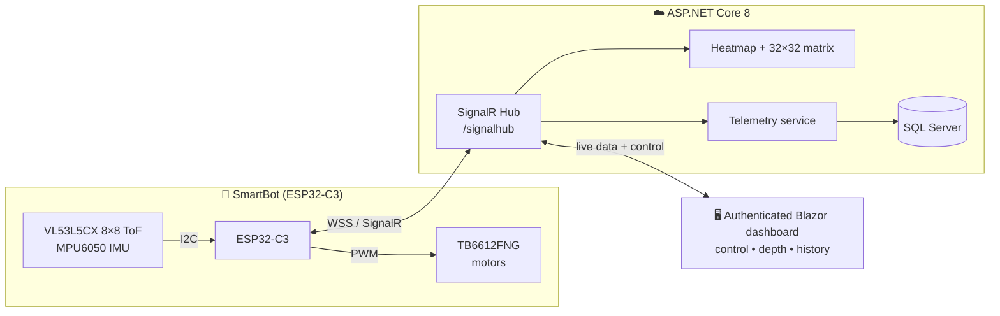
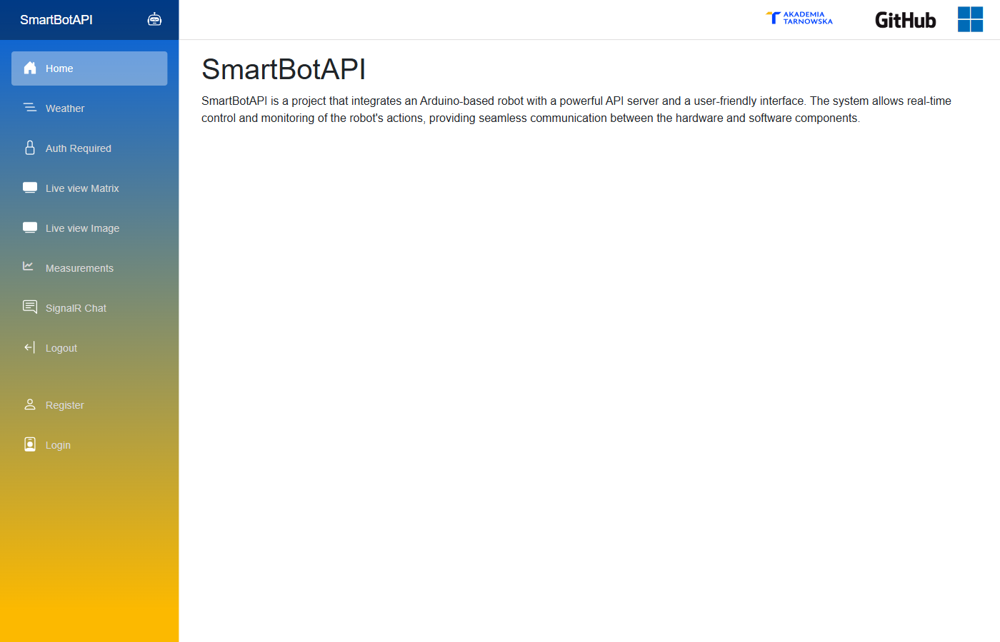
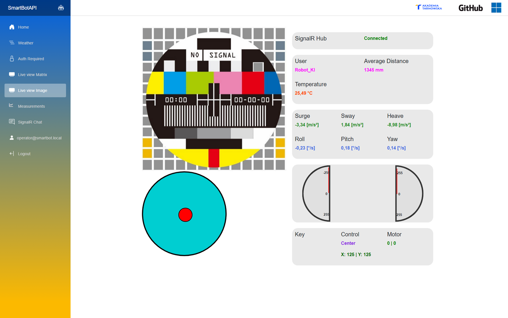
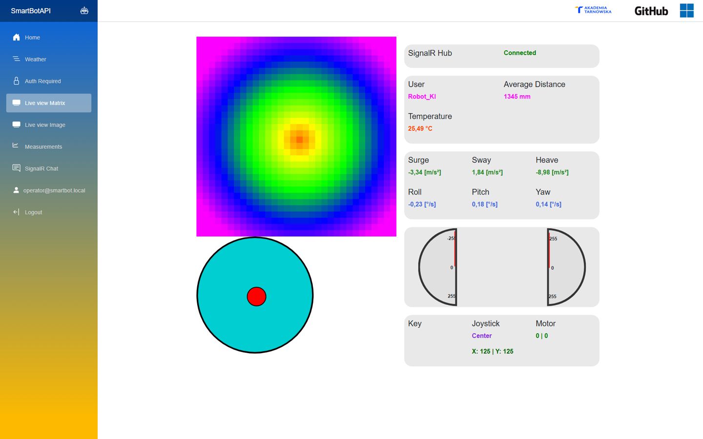
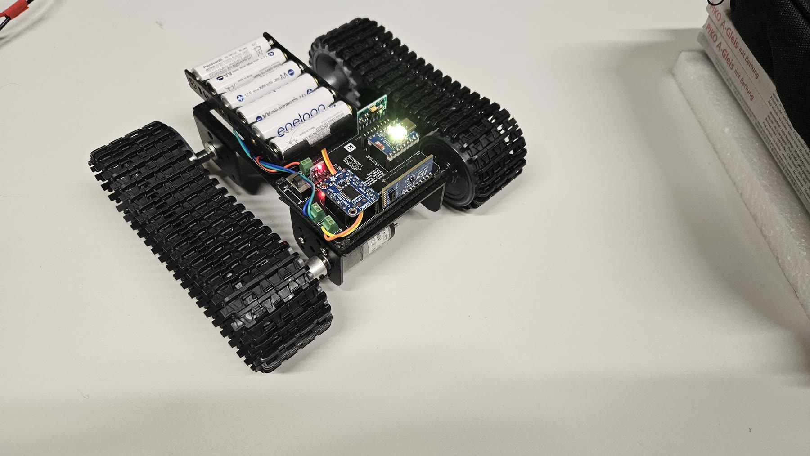
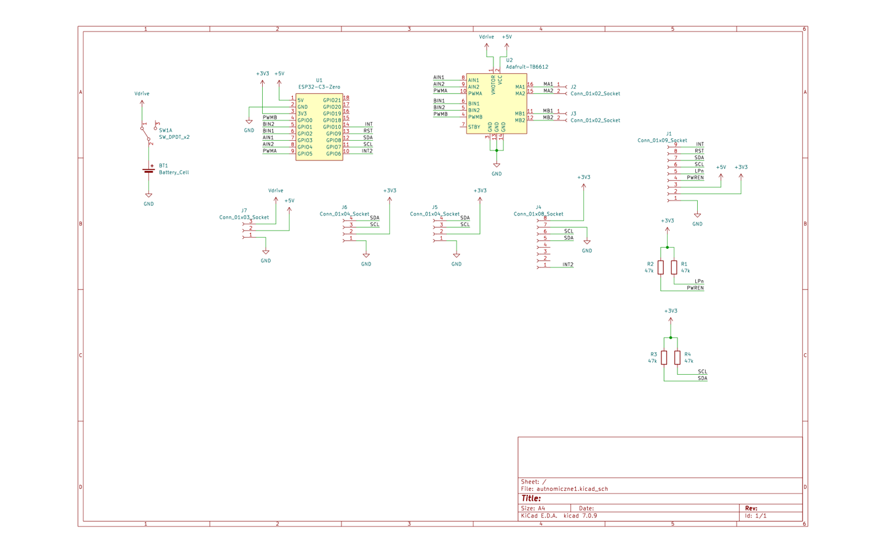

# SmartBotAPI

[](https://dotnet.microsoft.com/)
[](https://learn.microsoft.com/aspnet/core/blazor/)
[](https://www.espressif.com/en/products/socs/esp32-c3)
[](https://github.com/Kamilr616/SmartBotAPI/actions/workflows/smartbotweb.yml)
[](LICENSE)

> 🇵🇱 [Wersja polska](README.pl.md)

**🗓️ Project period:** 2024–2025

> 🎥 **Live demo:** for the project presentation the system was **deployed to Azure App Service** and fully working — an authenticated dashboard with **live depth-map streaming** from the robot *(it is no longer hosted)*. See it running with the physical robot in the [demo video](https://www.facebook.com/reel/1991337048036257).

**SmartBotAPI** is a full-stack robotics platform that connects an ESP32-C3–based mobile robot to a real-time web dashboard. The robot streams live telemetry — an 8×8 time-of-flight depth map, 6-axis IMU data, and temperature — over a secure WebSocket/SignalR channel, while operators drive it remotely with an on-screen joystick or keyboard. Measurements are persisted to SQL Server and visualized as live heatmaps, interpolated depth matrices, and historical charts.

---

## Table of Contents

- [System Overview](#system-overview)
- [Screenshots](#screenshots)
- [Demo](#demo)
- [Features](#features)
- [Tech Stack](#tech-stack)
- [Repository Structure](#repository-structure)
- [Quick Start](#quick-start)
  - [Web Server](#web-server)
  - [Robot Firmware](#robot-firmware)
- [Documentation](#documentation)
- [Deployment](#deployment)
- [Contributing & Security](#contributing--security)
- [License](#license)
- [Authors](#authors)

---

## System Overview



**Data flow in one sentence:** the robot samples its sensors at 15 Hz, pushes `ReceiveRobotData` invocations to the hub, which stores the measurements, renders the raw 8×8 depth frame into a heatmap and a 32×32 interpolated matrix, and broadcasts everything to connected dashboards — while movement commands travel the opposite way as `ReceiveRobotCommand` with PWM values for both motors.

## Screenshots

<p align="center">
  
  
</p>

<p align="center">
  
  
</p>

The control-panel screenshots use representative test telemetry and a simulated ToF frame; during operation the same views are updated with live SignalR data from the robot.

The physical tracked robot used during development and corridor driving tests:

<p align="center">
  
  
</p>

### Custom robot PCB

The robot uses a custom carrier PCB for the controller, motor-driver module, sensor connectors, power switch, and battery connection. The original KiCad circuit is available as [`docs/schemat.pdf`](docs/schemat.pdf).

<p align="center">
  
  
</p>

## 🎥 Demo

A short local driving-test montage and a recorded live presentation of the complete system (Department of Computer Science, Akademia Tarnowska):

- **[▶ Watch the driving-test montage](docs/media/smartbot-driving-demo.mp4)** *(78 s, no audio)*
- **[▶ Watch the full presentation on Facebook](https://www.facebook.com/reel/1991337048036257)**

## Features

- **Real-time remote control** — virtual joystick (pointer events) and keyboard (arrow keys) input, mapped to dual-motor PWM commands in the `-255…+255` range, with dual speedometer gauges for feedback.
- **Live depth vision** — the 8×8 VL53L5CX depth frame is rendered server-side into a color heatmap (PNG, base64) and a bilinearly interpolated 32×32 grid, streamed to the browser as it arrives.
- **Telemetry dashboard** — historical line charts (temperature, average distance, 3-axis acceleration, 3-axis rotation) with a date-range picker, backed by SQL Server.
- **Safety built into firmware** — automatic motor stop after 700 ms without a command, minimum-distance guard (400 mm), and automatic WebSocket reconnection every 5 s.
- **Multi-network firmware** — the robot tries up to three configured Wi-Fi networks and connects over TLS to the cloud-hosted hub.
- **Authenticated control plane** — dashboard pages and browser hub connections require ASP.NET Core Identity; the robot authenticates to the same hub with a separate API key.
- **Cloud-ready** — a Dockerfile and .NET container metadata (`kamilr616/smartbotblazorapp`), plus a GitHub Actions pipeline that builds, tests, and publishes a deployable artifact.

### One-joystick differential drive

The circular joystick controls throttle and steering at the same time instead of
selecting only four fixed directions. Its normalized vertical (`y`) and horizontal
(`x`) positions are mixed into independent motor commands:

```text
left motor  = clamp(y + x, -1, 1) × 255
right motor = clamp(y - x, -1, 1) × 255
```

This differential-drive mix makes the whole joystick surface useful: vertical input
drives both motors together, diagonal input produces proportional turns and smooth
arcs, and horizontal input drives the motors in opposite directions so the robot can
rotate around its own axis. A central stop dead zone prevents drift, while a wider
horizontal dead zone makes straight-line driving easier. Releasing the pointer sends
an immediate stop command; while it is held, movement commands are refreshed every
250 ms so the firmware's 700 ms dead-man timer remains satisfied.

The arrow keys provide a discrete, full-power alternative: `↑`/`↓` drive forward or
backward and `←`/`→` rotate in place. The dashboard displays the resulting PWM value
for each motor on its two speedometer gauges.

## Tech Stack

| Layer | Technology |
|---|---|
| Web framework | ASP.NET Core 8.0, Blazor (Interactive Server + WebAssembly hybrid) |
| UI components | MudBlazor 7, Bootstrap 5 |
| Real-time transport | SignalR (JSON protocol) over WebSocket/TLS |
| Data | Entity Framework Core 9, SQL Server (LocalDB in development) |
| Image processing | SixLabors.ImageSharp (heatmap rendering, bilinear interpolation) |
| Identity | ASP.NET Core Identity |
| Firmware | Arduino framework on ESP32-C3 (Arduino IDE 2.x) |
| Firmware libraries | ArduinoJson, SparkFun VL53L5CX, Adafruit MPU6050, WebSockets (Markus Sattler) |
| Hardware | ESP32-C3 DevKitM-1, VL53L5CX ToF sensor, MPU6050 IMU, TB6612FNG motor driver, NeoPixel status LED |
| DevOps | Docker, GitHub Actions, Azure App Service (presentation deployment) |

## Repository Structure

```
SmartBotAPI/
├── src/
│   ├── server/
│   │   ├── SmartBotBlazorApp/          # ASP.NET Core host: SignalR hub, EF Core, Identity, server pages
│   │   │   ├── Hubs/SignalHub.cs       # Real-time hub (/signalhub)
│   │   │   ├── ImageProcessor.cs       # Heatmap generation & matrix interpolation
│   │   │   ├── Data/                   # DbContext, Measurement entity, MeasurementService, migrations
│   │   │   └── Components/Pages/       # Heatmap, matrix, charts, weather pages
│   │   └── SmartBotBlazorApp.Client/   # Blazor WebAssembly client
│   │       └── Pages/Chat.razor        # SignalR text diagnostics page
│   └── arduino/
│       └── sketch_robot_signalr/       # ESP32-C3 firmware (main sketch + config.h)
├── docs/                               # Project documentation, schematics & datasheets
├── other/                              # Legacy sketches, PlatformIO project, Azure templates
├── LICENSE                             # GNU GPL v3.0
├── SECURITY.md                         # Vulnerability reporting policy
└── THIRD_PARTY_NOTICES.md              # Separately licensed third-party material
```

## Quick Start

### Web Server

**Prerequisites:** [.NET SDK 8.0](https://dotnet.microsoft.com/download/dotnet/8.0), SQL Server LocalDB (ships with Visual Studio) or any SQL Server instance.

```powershell
cd src/server/SmartBotBlazorApp
$env:RobotApiKey = "replace-with-a-url-safe-random-key-of-at-least-32-characters"
dotnet restore
dotnet run --launch-profile https
```

The app applies EF Core migrations automatically on startup and listens on:

- `https://localhost:7297`
- `http://localhost:5221`

To use a different database, set the `SmartBotDBConnectionString` environment variable — it takes precedence over `ConnectionStrings:DefaultConnection` in `appsettings.json`.

**Docker:**

```bash
cd src/server
docker build -t smartbotblazorapp -f SmartBotBlazorApp/Dockerfile .
docker run -p 8080:8080 \
  -e SmartBotDBConnectionString="<your-connection-string>" \
  -e RobotApiKey="<same-long-random-key-as-the-firmware>" \
  smartbotblazorapp
```

### Robot Firmware

**Prerequisites:** Arduino IDE 2.x with the ESP32 board package; an ESP32-C3 DevKitM-1 wired per the schematic in [`docs/schemat.pdf`](docs/schemat.pdf).

1. Copy `arduino_secrets.example.h` to `arduino_secrets.h` and set the robot API key plus Wi-Fi credentials:

   ```cpp
   #define SECRET_API_KEY "same-url-safe-random-key-as-the-server"

   #define SECRET_SSID  "your-wifi"
   #define SECRET_PASS  "your-password"
   #define SECRET_SSID2 "fallback-wifi"
   #define SECRET_PASS2 "fallback-password"
   #define SECRET_SSID3 "third-wifi"
   #define SECRET_PASS3 "third-password"
   ```

2. Point the firmware at your server in `config.h` (`SERVER_IP`, `SERVER_PORT`).
3. Install the libraries listed in [Tech Stack](#tech-stack) via the Library Manager, select the **ESP32-C3 DevKitM-1** board, set **Tools → Partition Scheme → Huge APP (3MB No OTA/1MB SPIFFS)**, and upload `sketch_robot_signalr.ino`.

Once connected, the robot appears on the **Image Receiver** page of the authenticated dashboard and starts streaming telemetry.

## Documentation

| Document | Contents |
|---|---|
| [Architecture & Communication](docs/architecture.md) | System design, SignalR message contracts, data flow |
| [Getting Started](docs/getting-started.md) | Detailed setup for server, database, and firmware |
| [Server Application](docs/server.md) | Pages, services, hub API, data model, configuration reference |
| [Firmware & Hardware](docs/firmware.md) | Pinout, sensor configuration, control loop, safety behavior |

Hardware reference material (datasheets and schematics for the VL53L5CX, TB6612FNG, and the robot's circuit) lives in [`docs/`](docs/).

## Deployment

Pushing to `main` or opening a pull request against it triggers the GitHub Actions workflow (`.github/workflows/smartbotweb.yml`), which builds and tests the solution and publishes a deployable web-app artifact. It does not deploy to an external environment automatically.

For the project presentation, the application was deployed to the **smartbotweb** Azure App Service and the firmware targeted `smartbotweb.azurewebsites.net:443`. That service is no longer hosted; the current firmware configuration uses an explicit placeholder that must be replaced with the address of the current server before use.

## Contributing & Security

Issues and pull requests are welcome. To report a security vulnerability, please follow the process described in [SECURITY.md](SECURITY.md) instead of opening a public issue.

## License

This project is licensed under the [GNU General Public License v3.0](LICENSE) — © 2024 Kamil Rataj. Separately licensed third-party material is listed in [THIRD_PARTY_NOTICES.md](THIRD_PARTY_NOTICES.md).

## 👥 Authors

- **Kamil Rataj** — author & maintainer — [GitHub](https://github.com/Kamilr616) · [LinkedIn](https://www.linkedin.com/in/kamil-r-153ab7121/)
- **Mateusz Ciszek** ([@Matix351](https://github.com/Matix351)) — contributor
