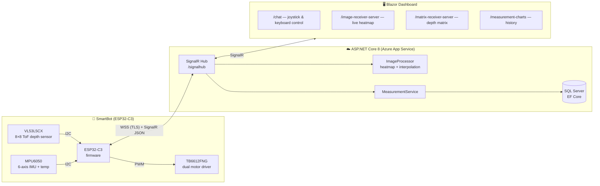

# SmartBotAPI

[](https://dotnet.microsoft.com/)
[](https://learn.microsoft.com/aspnet/core/blazor/)
[](https://www.espressif.com/en/products/socs/esp32-c3)
[](https://azure.microsoft.com/)
[](LICENSE)

> 🇵🇱 [Wersja polska](README.pl.md)

**🗓️ Project period:** 2024–2025

> 🎥 **Live demo:** for the project presentation the system was **deployed to Azure App Service** and fully working — an authenticated dashboard with **live depth-map streaming** from the robot *(it is no longer hosted)*. See it running with the physical robot in the [demo video](https://www.facebook.com/reel/1991337048036257).

**SmartBotAPI** is a full-stack robotics platform that connects an ESP32-C3–based mobile robot to a real-time web dashboard. The robot streams live telemetry — a 8×8 time-of-flight depth map, 6-axis IMU data, and temperature — over a secure WebSocket/SignalR channel, while operators drive it remotely with an on-screen joystick or keyboard. Measurements are persisted to SQL Server and visualized as live heatmaps, interpolated depth matrices, and historical charts.

---

## Table of Contents

- [System Overview](#system-overview)
- [Features](#features)
- [Tech Stack](#tech-stack)
- [Repository Structure](#repository-structure)
- [Quick Start](#quick-start)
  - [Web Server](#web-server)
  - [Robot Firmware](#robot-firmware)
- [Documentation](#documentation)
- [Deployment](#deployment)
- [Contributing & Security](#contributing--security)
- [License](#license)

---

## System Overview



**Data flow in one sentence:** the robot samples its sensors at 15 Hz, pushes `ReceiveRobotData` invocations to the hub, which stores the measurements, renders the raw 8×8 depth frame into a heatmap and a 32×32 interpolated matrix, and broadcasts everything to connected dashboards — while movement commands travel the opposite way as `ReceiveRobotCommand` with PWM values for both motors.

## Screenshots


## 🎥 Demo

A recorded live presentation of the system driving the physical robot (Department of Computer Science, Akademia Tarnowska):

**[▶ Watch the demo on Facebook](https://www.facebook.com/reel/1991337048036257)**

## Features

- **Real-time remote control** — virtual joystick (pointer events) and keyboard (arrow keys) input, mapped to dual-motor PWM commands in the `-255…+255` range, with dual speedometer gauges for feedback.
- **Live depth vision** — the 8×8 VL53L5CX depth frame is rendered server-side into a color heatmap (PNG, base64) and a bilinearly interpolated 32×32 grid, streamed to the browser as it arrives.
- **Telemetry dashboard** — historical line charts (temperature, average distance, 3-axis acceleration, 3-axis rotation) with a date-range picker, backed by SQL Server.
- **Safety built into firmware** — automatic motor stop after 700 ms without a command, minimum-distance guard (400 mm), and automatic WebSocket reconnection every 5 s.
- **Multi-network firmware** — the robot tries up to three configured Wi-Fi networks and connects over TLS to the cloud-hosted hub.
- **Authentication-ready** — ASP.NET Core Identity (registration, login, 2FA, account management) is wired in; per-page authorization can be enabled with a single attribute.
- **Cloud-native** — Dockerfile, container image (`kamilr616/smartbotblazorapp`), and a GitHub Actions pipeline deploying to Azure App Service on every push to `main`.

## Tech Stack

| Layer | Technology |
|---|---|
| Web framework | ASP.NET Core 8.0, Blazor (Interactive Server + WebAssembly hybrid) |
| UI components | MudBlazor 7, Bootstrap 5 |
| Real-time transport | SignalR (JSON protocol) over WebSocket/TLS |
| Data | Entity Framework Core 9, SQL Server (LocalDB in development) |
| Image processing | SixLabors.ImageSharp (heatmap rendering, bilinear interpolation) |
| Identity | ASP.NET Core Identity |
| Firmware | Arduino framework on ESP32-C3 (Arduino IDE or PlatformIO) |
| Firmware libraries | ArduinoJson, SparkFun VL53L5CX, Adafruit MPU6050, WebSockets (Markus Sattler) |
| Hardware | ESP32-C3 DevKitM-1, VL53L5CX ToF sensor, MPU6050 IMU, TB6612FNG motor driver, NeoPixel status LED |
| DevOps | Docker, GitHub Actions, Azure App Service |

## Repository Structure

```
SmartBotAPI/
├── src/
│   ├── server/
│   │   ├── SmartBotBlazorApp/          # ASP.NET Core host: SignalR hub, EF Core, Identity, server pages
│   │   │   ├── Hubs/SignalHub.cs       # Real-time hub (/signalhub)
│   │   │   ├── ImageProcessor.cs       # Heatmap generation & matrix interpolation
│   │   │   ├── Data/                   # DbContext, Measurement entity, MeasurementService, migrations
│   │   │   └── Components/Pages/       # Heatmap, matrix, charts, weather pages
│   │   └── SmartBotBlazorApp.Client/   # Blazor WebAssembly client
│   │       └── Pages/Chat.razor        # Robot control page (joystick, keyboard, gauges)
│   └── arduino/
│       └── sketch_robot_signalr/       # ESP32-C3 firmware (main sketch + config.h)
├── docs/                               # Project documentation, schematics & datasheets
├── other/                              # Legacy sketches, PlatformIO project, Azure templates
├── LICENSE                             # MIT
└── SECURITY.md                         # Vulnerability reporting policy
```

## Quick Start

### Web Server

**Prerequisites:** [.NET SDK 8.0](https://dotnet.microsoft.com/download/dotnet/8.0), SQL Server LocalDB (ships with Visual Studio) or any SQL Server instance.

```bash
cd src/server/SmartBotBlazorApp
dotnet restore
dotnet run --launch-profile https
```

The app applies EF Core migrations automatically on startup and listens on:

- `https://localhost:7297`
- `http://localhost:5221`

To use a different database, set the `SmartBotDBConnectionString` environment variable — it takes precedence over `ConnectionStrings:DefaultConnection` in `appsettings.json`.

**Docker:**

```bash
cd src/server
docker build -t smartbotblazorapp -f SmartBotBlazorApp/Dockerfile .
docker run -p 8080:8080 \
  -e SmartBotDBConnectionString="<your-connection-string>" \
  smartbotblazorapp
```

### Robot Firmware

**Prerequisites:** Arduino IDE 2.x (with the ESP32 board package) or PlatformIO; an ESP32-C3 DevKitM-1 wired per the schematic in [`docs/schemat.pdf`](docs/schemat.pdf).

1. Create `src/arduino/sketch_robot_signalr/arduino_secrets.h` with your Wi-Fi credentials:

   ```cpp
   #define SECRET_SSID  "your-wifi"
   #define SECRET_PASS  "your-password"
   #define SECRET_SSID2 "fallback-wifi"
   #define SECRET_PASS2 "fallback-password"
   #define SECRET_SSID3 "third-wifi"
   #define SECRET_PASS3 "third-password"
   ```

2. Point the firmware at your server in `config.h` (`SERVER_IP`, `SERVER_PORT`).
3. Install the libraries listed in [Tech Stack](#tech-stack) via the Library Manager, select the **ESP32-C3 DevKitM-1** board, and upload `sketch_robot_signalr.ino`.

Once connected, the robot appears on the **Chat** page of the dashboard and starts streaming telemetry.

## Documentation

| Document | Contents |
|---|---|
| [Architecture & Communication](docs/architecture.md) | System design, SignalR message contracts, data flow |
| [Getting Started](docs/getting-started.md) | Detailed setup for server, database, and firmware |
| [Server Application](docs/server.md) | Pages, services, hub API, data model, configuration reference |
| [Firmware & Hardware](docs/firmware.md) | Pinout, sensor configuration, control loop, safety behavior |

Hardware reference material (datasheets and schematics for the VL53L5CX, TB6612FNG, and the robot's circuit) lives in [`docs/`](docs/).

## Deployment

Pushing to `main` triggers the GitHub Actions workflow (`.github/workflows/smartbotweb.yml`), which builds, tests, publishes, and deploys the app to the **smartbotweb** Azure App Service using a publish-profile secret. The firmware's default endpoint (`smartbotweb.azurewebsites.net:443`) matches this deployment.

## Contributing & Security

Issues and pull requests are welcome. To report a security vulnerability, please follow the process described in [SECURITY.md](SECURITY.md) instead of opening a public issue.

## License

This project is licensed under the [MIT License](LICENSE) — © 2024 Kamil Rataj.

## 👥 Authors

- **Kamil Rataj** — author & maintainer — [GitHub](https://github.com/Kamilr616) · [LinkedIn](https://www.linkedin.com/in/kamil-r-153ab7121/)
- **Mateusz** ([@Matix351](https://github.com/Matix351)) — contributor
