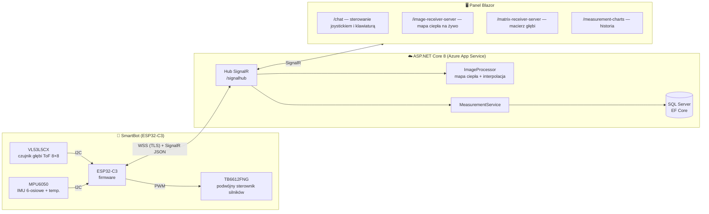

# SmartBotAPI

[](https://dotnet.microsoft.com/)
[](https://learn.microsoft.com/aspnet/core/blazor/)
[](https://www.espressif.com/en/products/socs/esp32-c3)
[](https://azure.microsoft.com/)
[](LICENSE)

> 🇬🇧 [English version](README.md)

**🗓️ Okres realizacji:** 2024–2025

> 🎥 **Demo na żywo:** na potrzeby prezentacji system był **wdrożony na Azure App Service** i w pełni działający — panel z uwierzytelnianiem oraz **podglądem mapy głębi na żywo** z robota *(obecnie nie jest hostowany)*. Zobacz działanie z fizycznym robotem na [filmie demonstracyjnym](https://www.facebook.com/reel/1991337048036257).

**SmartBotAPI** to pełnostackowa platforma robotyczna, która łączy mobilnego robota opartego na **ESP32-C3** z panelem webowym działającym w czasie rzeczywistym. Robot przesyła na żywo telemetrię — mapę głębi 8×8 z czujnika ToF, dane 6-osiowego IMU oraz temperaturę — bezpiecznym kanałem WebSocket/SignalR, a operator steruje nim zdalnie ekranowym joystickiem lub klawiaturą. Pomiary są zapisywane w SQL Server i wizualizowane jako mapy ciepła, interpolowane macierze głębi oraz wykresy historyczne.

---

## Spis treści

- [Przegląd systemu](#przegląd-systemu)
- [Funkcje](#funkcje)
- [Stack technologiczny](#stack-technologiczny)
- [Struktura repozytorium](#struktura-repozytorium)
- [Szybki start](#szybki-start)
- [Dokumentacja](#dokumentacja)
- [Wdrożenie](#wdrożenie)
- [Licencja](#licencja)

---

## Przegląd systemu



**Przepływ danych w jednym zdaniu:** robot próbkuje czujniki z częstotliwością 15 Hz, wysyła wywołania `ReceiveRobotData` do huba, który zapisuje pomiary, renderuje surową klatkę głębi 8×8 do mapy ciepła oraz interpolowanej macierzy 32×32 i rozsyła wszystko do podłączonych paneli — a komendy ruchu wędrują w drugą stronę jako `ReceiveRobotCommand` z wartościami PWM dla obu silników.

## Zrzuty ekranu


## 🎥 Demo

Nagranie prezentacji systemu na żywo, sterującego fizycznym robotem (Katedra Informatyki, Akademia Tarnowska):

**[▶ Obejrzyj demo na Facebooku](https://www.facebook.com/reel/1991337048036257)**

## Funkcje

- **Zdalne sterowanie w czasie rzeczywistym** — wirtualny joystick (zdarzenia wskaźnika) i klawiatura (strzałki), mapowane na komendy PWM obu silników w zakresie `-255…+255`, z dwoma prędkościomierzami dla informacji zwrotnej.
- **Podgląd głębi na żywo** — klatka głębi 8×8 z VL53L5CX renderowana po stronie serwera do kolorowej mapy ciepła (PNG, base64) oraz interpolowanej dwuliniowo siatki 32×32, strumieniowana do przeglądarki na bieżąco.
- **Panel telemetrii** — historyczne wykresy liniowe (temperatura, średnia odległość, przyspieszenie 3-osiowe, obrót 3-osiowy) z wyborem zakresu dat, oparte o SQL Server.
- **Bezpieczeństwo w firmware** — automatyczny stop silników po 700 ms bez komendy, zabezpieczenie minimalnej odległości (400 mm) i automatyczne ponowne łączenie WebSocket co 5 s.
- **Firmware wielosieciowe** — robot próbuje połączyć się z maks. trzema skonfigurowanymi sieciami Wi-Fi i łączy się przez TLS z hubem w chmurze.
- **Gotowe uwierzytelnianie** — ASP.NET Core Identity (rejestracja, logowanie, 2FA, zarządzanie kontem); autoryzację per-strona włącza się jednym atrybutem.
- **Cloud-native** — Dockerfile, obraz kontenera (`kamilr616/smartbotblazorapp`) i pipeline GitHub Actions wdrażający na Azure App Service przy każdym pushu do `main`.

## Stack technologiczny

| Warstwa | Technologia |
|---|---|
| Framework web | ASP.NET Core 8.0, Blazor (Interactive Server + WebAssembly) |
| Komponenty UI | MudBlazor 7, Bootstrap 5 |
| Transport real-time | SignalR (protokół JSON) po WebSocket/TLS |
| Dane | Entity Framework Core 9, SQL Server (LocalDB w dev) |
| Przetwarzanie obrazu | SixLabors.ImageSharp (mapa ciepła, interpolacja dwuliniowa) |
| Tożsamość | ASP.NET Core Identity |
| Firmware | Arduino na ESP32-C3 (Arduino IDE lub PlatformIO) |
| Biblioteki firmware | ArduinoJson, SparkFun VL53L5CX, Adafruit MPU6050, WebSockets (Markus Sattler) |
| Sprzęt | ESP32-C3 DevKitM-1, czujnik ToF VL53L5CX, IMU MPU6050, sterownik silników TB6612FNG, dioda statusu NeoPixel |
| DevOps | Docker, GitHub Actions, Azure App Service |

## Struktura repozytorium

```
SmartBotAPI/
├── src/
│   ├── server/
│   │   ├── SmartBotBlazorApp/          # Host ASP.NET Core: hub SignalR, EF Core, Identity, strony serwerowe
│   │   │   ├── Hubs/SignalHub.cs       # Hub czasu rzeczywistego (/signalhub)
│   │   │   ├── ImageProcessor.cs       # Generowanie mapy ciepła i interpolacja macierzy
│   │   │   ├── Data/                   # DbContext, encja Measurement, MeasurementService, migracje
│   │   │   └── Components/Pages/        # Strony: mapa ciepła, macierz, wykresy, pogoda
│   │   └── SmartBotBlazorApp.Client/    # Klient Blazor WebAssembly
│   │       └── Pages/Chat.razor         # Strona sterowania robotem (joystick, klawiatura, wskaźniki)
│   └── arduino/
│       └── sketch_robot_signalr/        # Firmware ESP32-C3 (główny szkic + config.h)
├── docs/                                # Dokumentacja, schematy i datasheety
├── other/                               # Starsze szkice, projekt PlatformIO, szablony Azure
├── LICENSE                              # MIT
└── SECURITY.md                          # Polityka zgłaszania podatności
```

## Szybki start

### Serwer webowy

**Wymagania:** [.NET SDK 8.0](https://dotnet.microsoft.com/download/dotnet/8.0), SQL Server LocalDB (z Visual Studio) lub dowolna instancja SQL Server.

```bash
cd src/server/SmartBotBlazorApp
dotnet restore
dotnet run --launch-profile https
```

Aplikacja automatycznie stosuje migracje EF Core przy starcie i nasłuchuje na:

- `https://localhost:7297`
- `http://localhost:5221`

Aby użyć innej bazy, ustaw zmienną środowiskową `SmartBotDBConnectionString` — ma pierwszeństwo przed `ConnectionStrings:DefaultConnection` w `appsettings.json`.

**Docker:**

```bash
cd src/server
docker build -t smartbotblazorapp -f SmartBotBlazorApp/Dockerfile .
docker run -p 8080:8080 \
  -e SmartBotDBConnectionString="<twój-connection-string>" \
  smartbotblazorapp
```

### Firmware robota

**Wymagania:** Arduino IDE 2.x (z pakietem płytek ESP32) lub PlatformIO; ESP32-C3 DevKitM-1 połączone wg schematu w [`docs/schemat.pdf`](docs/schemat.pdf).

1. Utwórz `src/arduino/sketch_robot_signalr/arduino_secrets.h` z danymi Wi-Fi:

   ```cpp
   #define SECRET_SSID  "twoje-wifi"
   #define SECRET_PASS  "twoje-haslo"
   #define SECRET_SSID2 "zapasowe-wifi"
   #define SECRET_PASS2 "zapasowe-haslo"
   #define SECRET_SSID3 "trzecie-wifi"
   #define SECRET_PASS3 "trzecie-haslo"
   ```

2. Wskaż adres serwera w `config.h` (`SERVER_IP`, `SERVER_PORT`).
3. Zainstaluj biblioteki wymienione w [Stacku technologicznym](#stack-technologiczny), wybierz płytkę **ESP32-C3 DevKitM-1** i wgraj `sketch_robot_signalr.ino`.

Po połączeniu robot pojawia się na stronie **Chat** panelu i zaczyna strumieniować telemetrię.

## Dokumentacja

| Dokument | Zawartość |
|---|---|
| [Architektura i komunikacja](docs/architecture.md) | Projekt systemu, kontrakty wiadomości SignalR, przepływ danych |
| [Getting Started](docs/getting-started.md) | Szczegółowa konfiguracja serwera, bazy i firmware |
| [Aplikacja serwerowa](docs/server.md) | Strony, serwisy, API huba, model danych, konfiguracja |
| [Firmware i sprzęt](docs/firmware.md) | Pinout, konfiguracja czujników, pętla sterowania, bezpieczeństwo |

Materiały sprzętowe (datasheety i schematy VL53L5CX, TB6612FNG oraz układu robota) znajdują się w [`docs/`](docs/).

## Wdrożenie

Push do `main` uruchamia workflow GitHub Actions (`.github/workflows/smartbotweb.yml`), który buduje, testuje, publikuje i wdraża aplikację na Azure App Service **smartbotweb** z użyciem sekretu publish-profile. Domyślny endpoint firmware (`smartbotweb.azurewebsites.net:443`) odpowiada temu wdrożeniu.

## Licencja

Projekt na licencji [MIT](LICENSE) — © 2024 Kamil Rataj.

## 👥 Autorzy

- **Kamil Rataj** — autor i opiekun — [GitHub](https://github.com/Kamilr616) · [LinkedIn](https://www.linkedin.com/in/kamil-r-153ab7121/)
- **Mateusz** ([@Matix351](https://github.com/Matix351)) — współtwórca
