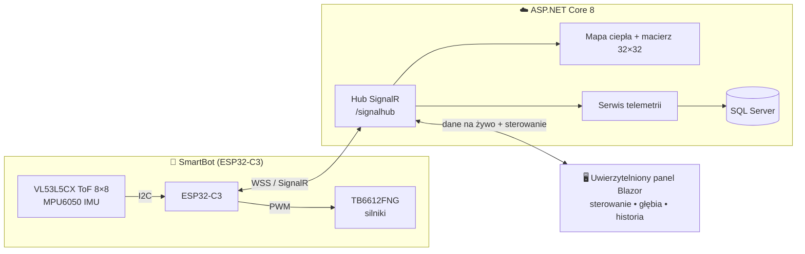
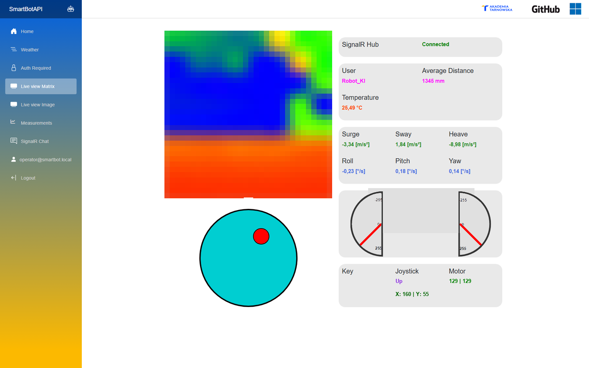
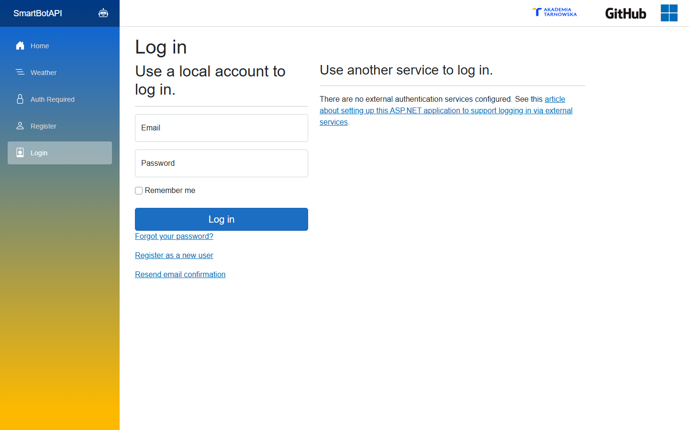
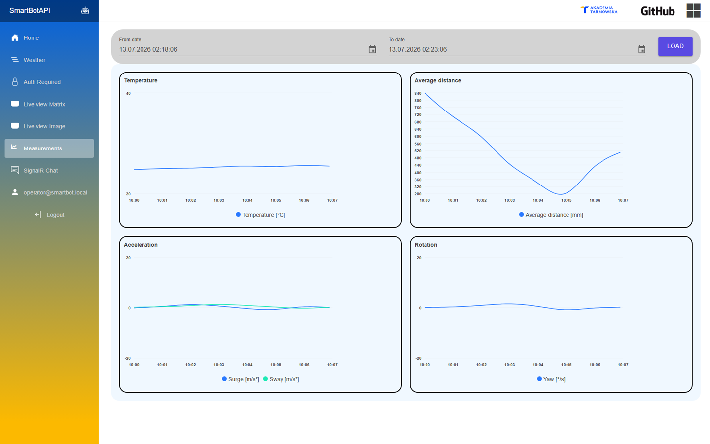
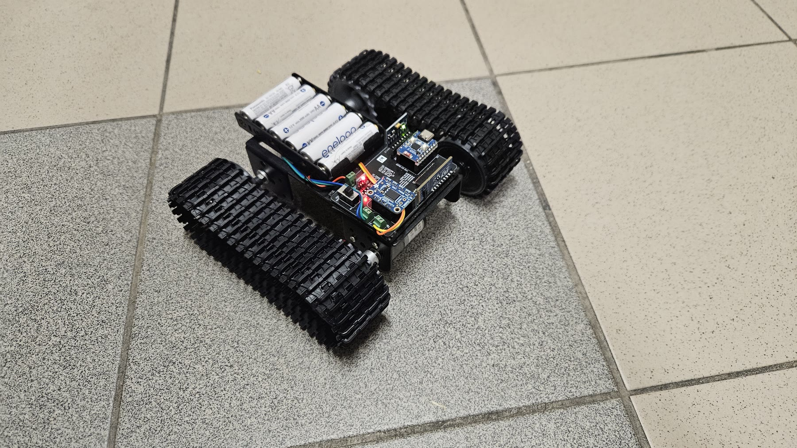
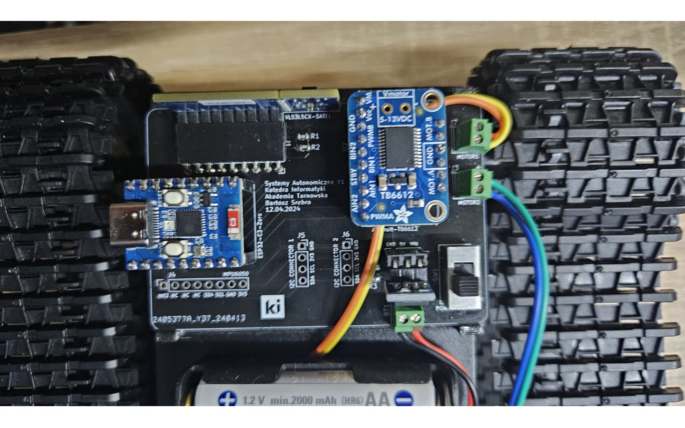

# SmartBotAPI

[](https://dotnet.microsoft.com/)
[](https://learn.microsoft.com/aspnet/core/blazor/)
[](https://www.espressif.com/en/products/socs/esp32-c3)
[](https://github.com/Kamilr616/SmartBotAPI/actions/workflows/smartbotweb.yml)
[](LICENSE)

> 🇬🇧 [English version](README.md)

**🗓️ Okres realizacji:** 2024–2025

> 🎥 **Demo na żywo:** na potrzeby prezentacji system był **wdrożony na Azure App Service** i w pełni działający — panel z uwierzytelnianiem oraz **podglądem mapy głębi na żywo** z robota *(obecnie nie jest hostowany)*. Zobacz działanie z fizycznym robotem na [filmie demonstracyjnym](https://www.facebook.com/reel/1991337048036257).

**SmartBotAPI** to pełnostackowa platforma robotyczna, która łączy mobilnego robota opartego na **ESP32-C3** z panelem webowym działającym w czasie rzeczywistym. Robot przesyła na żywo telemetrię — mapę głębi 8×8 z czujnika ToF, dane 6-osiowego IMU oraz temperaturę — bezpiecznym kanałem WebSocket/SignalR, a operator steruje nim zdalnie ekranowym joystickiem lub klawiaturą. Pomiary są zapisywane w SQL Server i wizualizowane jako mapy ciepła, interpolowane macierze głębi oraz wykresy historyczne.

---

## Spis treści

- [Przegląd systemu](#przegląd-systemu)
- [Zrzuty ekranu](#zrzuty-ekranu)
- [Demo](#demo)
- [Funkcje](#funkcje)
- [Stack technologiczny](#stack-technologiczny)
- [Struktura repozytorium](#struktura-repozytorium)
- [Szybki start](#szybki-start)
  - [Serwer webowy](#serwer-webowy)
  - [Firmware robota](#firmware-robota)
- [Dokumentacja](#dokumentacja)
- [Wdrożenie](#wdrożenie)
- [Współpraca i bezpieczeństwo](#współpraca-i-bezpieczeństwo)
- [Licencja](#licencja)
- [Autorzy](#autorzy)

---

## Przegląd systemu



**Przepływ danych w jednym zdaniu:** robot próbkuje czujniki z częstotliwością 15 Hz, wysyła wywołania `ReceiveRobotData` do huba, który zapisuje pomiary, renderuje surową klatkę głębi 8×8 do mapy ciepła oraz interpolowanej macierzy 32×32 i rozsyła wszystko do podłączonych paneli — a komendy ruchu wędrują w drugą stronę jako `ReceiveRobotCommand` z wartościami PWM dla obu silników.

## Zrzuty ekranu

<p align="center">
  
  
</p>

<p align="center">
  
  
</p>

Wizualizacje głębi na obu zrzutach podglądu wykorzystują klatkę ToF zarejestrowaną podczas rzeczywistego testu systemu; **Live View Matrix** przedstawia ją w siatce 32×32 aplikacji. Podczas pracy oba widoki są aktualizowane danymi przesyłanymi na żywo z robota przez SignalR.

Fizyczny robot gąsienicowy używany podczas prac i testów jazdy na korytarzu:

<p align="center">
  
  
</p>

### Dedykowana płytka PCB robota

Robot korzysta z dedykowanej płytki bazowej PCB dla kontrolera, modułu sterownika silników, złączy czujników, wyłącznika zasilania i połączenia akumulatora. Eksport schematu elektrycznego z programu KiCad jest dostępny w pliku [`docs/schemat.pdf`](docs/schemat.pdf).

<p align="center">
  
  
</p>

## 🎥 Demo

Krótki montaż z lokalnych testów jazdy oraz nagranie prezentacji kompletnego systemu (Katedra Informatyki, Akademia Tarnowska):

- **[▶ Obejrzyj montaż z testów jazdy](other/media/smartbot-driving-demo-music.mp4)** *(78 s, z muzyką)*
- **[▶ Obejrzyj pełną prezentację na Facebooku](https://www.facebook.com/reel/1991337048036257)**

Muzyka: **„New Direction” — Kevin MacLeod**, [CC BY 4.0](https://creativecommons.org/licenses/by/4.0/). Szczegóły źródła i modyfikacji: [THIRD_PARTY_NOTICES.md](THIRD_PARTY_NOTICES.md).

## Funkcje

- **Zdalne sterowanie w czasie rzeczywistym** — wirtualny joystick (zdarzenia wskaźnika) i klawiatura (strzałki), mapowane na komendy PWM obu silników w zakresie `-255…+255`, z dwoma prędkościomierzami dla informacji zwrotnej.
- **Podgląd głębi na żywo** — klatka głębi 8×8 z VL53L5CX renderowana po stronie serwera do kolorowej mapy ciepła (PNG, base64) oraz interpolowanej dwuliniowo siatki 32×32, strumieniowana do przeglądarki na bieżąco.
- **Panel telemetrii** — historyczne wykresy liniowe (temperatura, średnia odległość, przyspieszenie 3-osiowe, obrót 3-osiowy) z wyborem zakresu dat, oparte o SQL Server.
- **Bezpieczeństwo w firmware** — automatyczny stop silników po 700 ms bez komendy, zabezpieczenie minimalnej odległości (400 mm) i automatyczne ponowne łączenie WebSocket co 5 s.
- **Firmware wielosieciowe** — robot próbuje połączyć się z maks. trzema skonfigurowanymi sieciami Wi-Fi i obsługuje TLS/WSS podczas łączenia z adresem serwera ustawionym w `config.h`.
- **Uwierzytelniony panel sterowania** — strony panelu i połączenia przeglądarki z hubem wymagają ASP.NET Core Identity, a robot uwierzytelnia się w tym samym hubie oddzielnym kluczem API.
- **Gotowość do wdrożenia w chmurze** — Dockerfile i metadane kontenera .NET (`kamilr616/smartbotblazorapp`) oraz pipeline GitHub Actions budujący, testujący i publikujący artefakt gotowy do wdrożenia.

### Sterowanie różnicowe jednym joystickiem

Jeden proporcjonalny joystick łączy sterowanie prędkością i kierunkiem, umożliwiając
jazdę prosto, płynne pokonywanie łuków oraz obrót robota wokół własnej osi. Klawisze
strzałek są alternatywną metodą sterowania, a dwa prędkościomierze pokazują komendy
PWM silników. Równania miksowania, strefy martwe, częstotliwość komend, mapowanie
klawiszy i zabezpieczenia opisano w
[dokumentacji sterowania (EN)](docs/architecture.md#motion-control).

## Stack technologiczny

| Warstwa | Technologia |
|---|---|
| Framework web | ASP.NET Core 8.0, Blazor (Interactive Server + WebAssembly) |
| Komponenty UI | MudBlazor 7, Bootstrap 5 |
| Transport real-time | SignalR (protokół JSON) po WebSocket/TLS |
| Dane | Entity Framework Core 9, SQL Server (LocalDB w dev) |
| Przetwarzanie obrazu | SixLabors.ImageSharp (mapa ciepła, interpolacja dwuliniowa) |
| Tożsamość | ASP.NET Core Identity |
| Firmware | Arduino na ESP32-C3 (Arduino IDE 2.x) |
| Biblioteki firmware | ArduinoJson, SparkFun VL53L5CX, Adafruit MPU6050, WebSockets (Markus Sattler) |
| Sprzęt | ESP32-C3 DevKitM-1, czujnik ToF VL53L5CX, IMU MPU6050, sterownik silników TB6612FNG, dioda statusu NeoPixel |
| DevOps | Docker, GitHub Actions, Azure App Service (wdrożenie prezentacyjne) |

## Struktura repozytorium

```
SmartBotAPI/
├── src/
│   ├── server/
│   │   ├── SmartBotBlazorApp/          # Host ASP.NET Core: hub SignalR, EF Core, Identity, strony serwerowe
│   │   │   ├── Hubs/SignalHub.cs       # Hub czasu rzeczywistego (/signalhub)
│   │   │   ├── ImageProcessor.cs       # Generowanie mapy ciepła i interpolacja macierzy
│   │   │   ├── Data/                   # DbContext, encja Measurement, MeasurementService, migracje
│   │   │   └── Components/Pages/        # Strony: mapa ciepła, macierz, wykresy, pogoda
│   │   └── SmartBotBlazorApp.Client/    # Klient Blazor WebAssembly
│   │       └── Pages/Chat.razor         # Diagnostyka tekstowa SignalR
│   └── arduino/
│       └── sketch_robot_signalr/        # Firmware ESP32-C3 (główny szkic + config.h)
├── docs/                                # Dokumentacja, schemat projektu i odnośniki sprzętowe
├── other/                               # Multimedia i zarchiwizowane materiały projektu
│   ├── media/                           # Screenshoty README, zdjęcia i film demonstracyjny
│   └── ...                              # Starsze szkice, projekt PlatformIO, szablony Azure
├── LICENSE                              # GNU GPL v3.0
├── SECURITY.md                          # Polityka zgłaszania podatności
└── THIRD_PARTY_NOTICES.md               # Materiały na odrębnych licencjach
```

## Szybki start

### Serwer webowy

**Wymagania:** [.NET SDK 8.0](https://dotnet.microsoft.com/download/dotnet/8.0), SQL Server LocalDB w systemie Windows (instalowany z Visual Studio) lub dowolna dostępna instancja SQL Server.

```powershell
cd src/server/SmartBotBlazorApp
$env:RobotApiKey = "zastap-losowym-kluczem-url-safe-o-dlugosci-minimum-32-znakow"
dotnet restore
dotnet run --launch-profile https
```

Aplikacja automatycznie stosuje migracje EF Core przy starcie i nasłuchuje na:

- `https://localhost:7297`
- `http://localhost:5221`

Przy pierwszym uruchomieniu utwórz konto panelu pod adresem `https://localhost:7297/Account/Register`, a następnie się zaloguj.

Aby uruchomić testy automatyczne z katalogu głównego repozytorium:

```powershell
dotnet test src/server/SmartBotBlazorApp.sln
```

Aby użyć innej bazy, ustaw zmienną środowiskową `SmartBotDBConnectionString` — ma pierwszeństwo przed `ConnectionStrings:DefaultConnection` w `appsettings.json`.

**Docker:**

```bash
docker build -t smartbotblazorapp -f src/server/SmartBotBlazorApp/Dockerfile .
docker run -p 8080:8080 \
  -e SmartBotDBConnectionString="<twój-connection-string>" \
  -e RobotApiKey="<ten-sam-dlugi-losowy-klucz-co-w-firmware>" \
  smartbotblazorapp
```

### Firmware robota

**Wymagania:** Arduino IDE 2.x z pakietem płytek ESP32; ESP32-C3 DevKitM-1 połączone wg schematu w [`docs/schemat.pdf`](docs/schemat.pdf).

1. Skopiuj `arduino_secrets.example.h` jako `arduino_secrets.h` i ustaw klucz API robota oraz dane Wi-Fi:

   ```cpp
   #define SECRET_API_KEY "ten-sam-losowy-klucz-co-na-serwerze"

   #define SECRET_SSID  "twoje-wifi"
   #define SECRET_PASS  "twoje-haslo"
   #define SECRET_SSID2 "zapasowe-wifi"
   #define SECRET_PASS2 "zapasowe-haslo"
   #define SECRET_SSID3 "trzecie-wifi"
   #define SECRET_PASS3 "trzecie-haslo"
   ```

2. Wskaż adres serwera w `config.h` (`SERVER_IP`, `SERVER_PORT`).
3. Zainstaluj biblioteki wymienione w [Stacku technologicznym](#stack-technologiczny), wybierz płytkę **ESP32-C3 DevKitM-1**, ustaw **Narzędzia → Partition Scheme → Huge APP (3MB No OTA/1MB SPIFFS)** i wgraj `sketch_robot_signalr.ino`.

Po połączeniu robot pojawia się na stronie **Live View Image** zalogowanego panelu i zaczyna strumieniować telemetrię.

## Dokumentacja

| Dokument | Zawartość |
|---|---|
| [Architektura i komunikacja (EN)](docs/architecture.md) | Projekt systemu, kontrakty wiadomości SignalR, przepływ danych |
| [Getting Started (EN)](docs/getting-started.md) | Szczegółowa konfiguracja serwera, bazy i firmware |
| [Aplikacja serwerowa (EN)](docs/server.md) | Strony, serwisy, API huba, model danych, konfiguracja |
| [Firmware i sprzęt (EN)](docs/firmware.md) | Pinout, konfiguracja czujników, pętla sterowania, bezpieczeństwo |

[Dokumentacja firmware i sprzętu](docs/firmware.md) zawiera odnośniki do aktualnych datasheetów producentów. Schemat układu robota znajduje się w [`docs/`](docs/).

## Wdrożenie

Push do `main` lub otwarcie pull requesta do tej gałęzi uruchamia workflow GitHub Actions (`.github/workflows/smartbotweb.yml`), który buduje i testuje rozwiązanie oraz publikuje artefakt aplikacji webowej gotowy do wdrożenia. Workflow nie wdraża automatycznie do środowiska zewnętrznego.

Na potrzeby prezentacji projektu aplikacja była wdrożona na Azure App Service **smartbotweb**, a firmware łączył się z `smartbotweb.azurewebsites.net:443`. Usługa nie jest już hostowana; aktualna konfiguracja firmware zawiera jawny placeholder, który przed użyciem trzeba zastąpić adresem bieżącego serwera.

## Współpraca i bezpieczeństwo

Zgłoszenia błędów i pull requesty są mile widziane. Podatności bezpieczeństwa należy zgłaszać zgodnie z procedurą opisaną w [SECURITY.md](SECURITY.md), zamiast otwierać publiczne zgłoszenie.

## Licencja

Projekt jest udostępniany na licencji [GNU General Public License v3.0](LICENSE) — © 2024 Kamil Rataj. Materiały podlegające odrębnym licencjom wymieniono w pliku [THIRD_PARTY_NOTICES.md](THIRD_PARTY_NOTICES.md).

## 👥 Autorzy

- **Kamil Rataj** — autor i opiekun — [GitHub](https://github.com/Kamilr616) · [LinkedIn](https://www.linkedin.com/in/kamil-r-153ab7121/)
- **Mateusz Ciszek** ([@Matix351](https://github.com/Matix351)) — współtwórca
