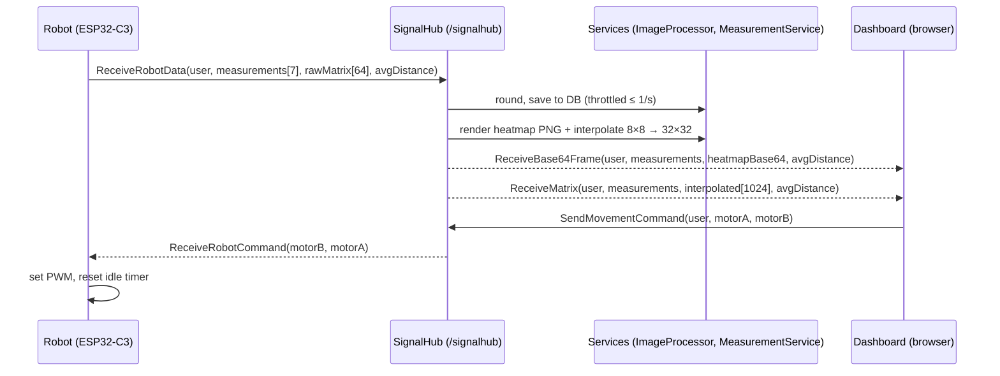

# Architecture & Communication

This document describes how the SmartBotAPI system is put together: the three main components, the real-time communication protocol between them, and the path a measurement takes from sensor to screen.

## Components

| Component | Location | Role |
|---|---|---|
| **Robot firmware** | `src/arduino/sketch_robot_signalr/` | Samples sensors, drives motors, maintains a WebSocket connection to the hub |
| **Web server** | `src/server/SmartBotBlazorApp/` | Hosts the SignalR hub, processes depth frames into images, persists telemetry, serves the dashboard |
| **Dashboard client** | `src/server/SmartBotBlazorApp.Client/` + server-rendered pages | Control UI (Blazor WebAssembly) and live/historical visualization pages (Blazor Server) |

## Transport

- **Protocol:** SignalR JSON hub protocol over WebSocket. The browser uses the official SignalR client; the ESP32 speaks the protocol directly — it performs the JSON handshake (`{"protocol":"json","version":1}`), then exchanges invocation messages (type `1`), each terminated by the SignalR record separator `0x1E`.
- **Security:** in production the robot connects via TLS (`wss://`) to `smartbotweb.azurewebsites.net:443`.
- **Hub endpoint:** `/signalhub` (mapped in `Program.cs`).
- **Reconnection:** the firmware retries the WebSocket every 5 s (`WS_RECONNECT_INTERVAL`); response compression is enabled server-side for `application/octet-stream`.

A capture of real handshake and invocation messages is available in `other/signalr_json.txt`.

## Hub Contract (`Hubs/SignalHub.cs`)

### Client → Server (invocable methods)

| Method | Parameters | Behavior |
|---|---|---|
| `SendMovementCommand` | `user: string`, `motorA: int`, `motorB: int` | Broadcasts `ReceiveRobotCommand(motorB, motorA)` to all *other* clients (i.e., the robot) |
| `ReceiveRobotData` | `user: string`, `measurements: double[7]`, `rawMatrix: ushort[64]`, `avgDistance: ushort` | Persists the measurement, generates visualizations, broadcasts to dashboards |
| `SendMessage` | `user: string`, `message: string` | Echo/broadcast utility (`ReceiveMessage` to all clients) |
| `ReceiveMessage` | `user: string`, `message: string` | Replies `"Message received!"` to the caller |

### Server → Client (events)

| Event | Consumers | Payload |
|---|---|---|
| `ReceiveRobotCommand` | Robot | `motorB: int`, `motorA: int` — PWM values in `-255…+255` |
| `ReceiveBase64Frame` | `/image-receiver-server`, `/chat` | `user`, rounded `measurements`, base64 PNG heatmap, `avgDistance` |
| `ReceiveMatrix` | `/matrix-receiver-server` | `user`, rounded `measurements`, interpolated `ushort[1024]` (32×32), `avgDistance` |
| `ReceiveMessage` | Any | `user`, `message` |

### Measurement array layout

The `measurements` array always has 7 elements, in this order:

| Index | Value | Unit |
|---|---|---|
| 0–2 | Acceleration X, Y, Z (surge, sway, heave) | m/s² |
| 3–5 | Rotation X, Y, Z (roll, pitch, yaw) | °/s |
| 6 | Temperature | °C |

`rawMatrix` is the row-major 8×8 VL53L5CX depth frame in millimeters; `avgDistance` is the average distance of the frame's central 4×4 zone, in millimeters.

## Server-Side Processing

Both transformations live in `ImageProcessor.cs` and run per incoming frame:

1. **Heatmap generation** — the 8×8 depth frame is normalized to the 10–3500 mm range and mapped onto a red → yellow → green → blue → purple gradient, rendered with ImageSharp and returned as a base64-encoded PNG (displayed at 512×512 in the browser).
2. **Bilinear interpolation** — the same frame is upsampled to 32×32 (`ushort[1024]`) for the interactive matrix view, where each cell is colored client-side.

`MeasurementService.cs` rounds measurements to 2 decimal places for display and writes them to the database, throttled to at most one insert per second per stream to avoid flooding the table at the 15 Hz sensor rate.

## Persistence

- **ORM:** Entity Framework Core (SQL Server provider). Migrations are applied automatically at startup (`Database.Migrate()` in `Program.cs`).
- **Entity:** `Measurement` (`Data/Measurement.cs`) — `Id`, `RobotId` (≤ 50 chars), `TemperatureC`, `AccelerationX/Y/Z`, `RotationX/Y/Z`, `AvgDistance`, `Timestamp`.
- **Connection resolution order:** `SmartBotDBConnectionString` environment variable → `ConnectionStrings:DefaultConnection` in `appsettings.json`.

## Rendering Model

The web application uses Blazor's hybrid rendering:

- **Interactive Server** pages (`SmartBotBlazorApp/Components/Pages/`) — live visualization pages that hold a SignalR connection server-side.
- **Interactive WebAssembly** pages (`SmartBotBlazorApp.Client/Pages/`) — the `/chat` control page runs in the browser for minimal input latency, connecting to the hub directly from WASM.

ASP.NET Core Identity provides the account system (registration, login, 2FA, management pages under `/Account/*`). Authorization attributes exist on the receiver pages and can be enabled per page (`@attribute [Authorize]`).
